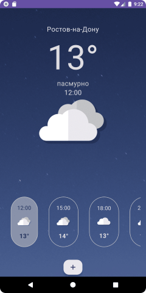
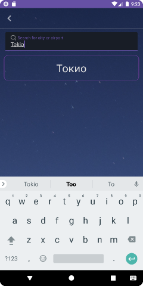
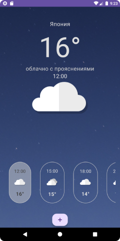

# WeatherApp

WeatherApp - это приложение для просмотра погоды. Оно позволяет пользователям получать актуальную информацию о погоде в выбранном городе.

## Скриншоты

## Особенности

- Просмотр текущей погоды и прогноза на несколько дней вперед
- Поиск погоды по городу
- Автоматическое обновление информации о погоде
- Просмотр детального прогноза на выбранный промежуток времени

## Требования

- Android 5.0 и выше
- Интернет-соединение для загрузки информации о погоде

## Установка

1. Скачайте и установите приложение с GitHub репозитория.
2. Запустите приложение и следуйте инструкциям на экране.

## Использование

1. Откройте приложение и введите название города в поле поиска.
2. Нажмите кнопку "Поиск" для получения информации о погоде.
3. Просмотрите текущую погоду и прогноз на несколько дней вперед.

## Архитектура приложения

Приложение использует архитектуру, основанную на концепциях action, store, state, datamiddleware, viewmodel и reducer.

- **Action**: объекты, которые представляют собой действия пользователя или системы.
- **Store**: хранилище состояния приложения.
- **State**: текущее состояние приложения.
- **Datamiddleware**: слой для работы с данными (загрузка данных с сервера или из локального хранилища).
- **Viewmodel**: объекты, которые предоставляют данные для отображения на экране.
- **Reducer**: функции для обновления состояния приложения в ответ на действия.

## Часто задаваемые вопросы (FAQ)

**В: Какие города поддерживаются приложением?** 
О: Приложение поддерживает большинство крупных городов мира.

**В: Можно ли изменить единицы измерения температуры?** 
О: Нет, единицы измерения температуры не могут быть изменены.

**В: Как часто обновляется информация о погоде?** 
О: Информация о погоде автоматически обновляется каждый час.

## Как внести свой вклад

Мы всегда рады помощи от сообщества! Если вы хотите помочь улучшить приложение, вы можете:

- Сообщить об ошибке или предложить новую функцию через раздел "Issues" на странице GitHub репозитория.
- Создать запрос на изменение (pull request) с исправлениями ошибок или добавлением новых функций.

## Лицензия

Это программное обеспечение распространяется под лицензией MIT.
